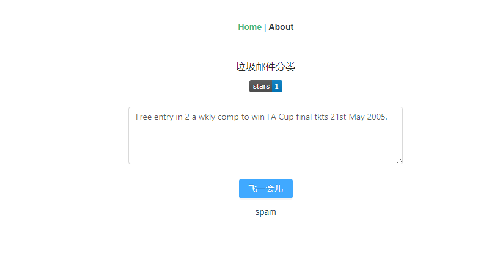

# mini-sms-classify
>垃圾邮件分类（朴素贝叶斯算法），使用flask+vue



## 朴素贝叶斯分类
## 如何运行
### server端
```bash
cd server
# 创建虚拟环境
python -m venv env
# 激活虚拟环境
source env/bin/activate
# 安装依赖包
pip install -r requirements.txt
# 启动flask
python app.py

```
### client端
```bash
npm install
npm run server
```